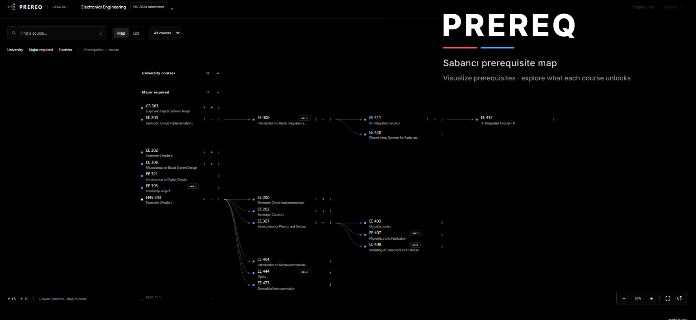

<p align="center">
  
</p>

<p align="center">
  <a href="https://prereq.sitegap-tools.workers.dev"><strong>Open PREREQ ↗</strong></a>
</p>

<p align="center">
  A visual prerequisite map for Sabancı University.
</p>

## How to use

1. Choose your **major**.
2. Choose your **first admission term**.
3. Open **University**, **Major required**, or **Electives**.
4. Click `+` on a course to reveal what it opens.
5. Click `i` to inspect prerequisites, corequisites, source wording, and official Sabancı links.
6. Use **My plan** to mark courses as planned or completed locally in your browser.

### Reading the graph

- `ALL 2` means both prerequisites are required.
- `ANY 3` means any one of the three is enough.
- `RULE` means the prerequisite contains mixed or special logic. Open the course details for the exact rule.
- A course with one prerequisite has no extra badge.

## Coverage

PREREQ currently bundles all configured Sabancı undergraduate majors for:

- Fall 2023 admission
- Fall 2024 admission
- Fall 2025 admission
- Fall 2026 admission

Degree categories and prerequisite rules are kept separate. The admission term decides which courses belong to **University**, **Major required**, **Core**, **Area**, and **Free** requirements.

Free-elective pools are intentionally not expanded into hundreds of graph nodes.

## How it works

PREREQ does not scrape hundreds of Sabancı pages every time somebody opens the site.

```text
Official degree requirements
          +
Official course pages
          ↓
     PREREQ collector
          ↓
normalized prerequisite rules
          ↓
   bundled static dataset
          ↓
       Cloudflare
```

The website reads the bundled dataset and renders the graph immediately. Shared course rules are reused across majors, while program- or admission-specific exceptions stay attached to the relevant degree.

## Sources and accuracy

Course and degree panels link back to the official Sabancı pages used by the app.

PREREQ is an independent student project. Sabancı's official Degree Evaluation, registration system, faculty rules, instructor approvals, substitutions, waivers, and university records remain authoritative.

## Stack

Vanilla JavaScript · CSS · SVG · Python · Cloudflare Workers static assets

MIT licensed.
