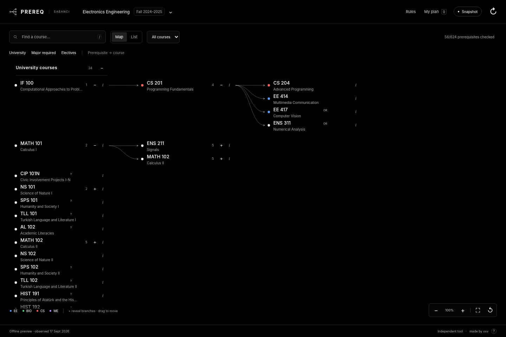

# PREREQ

Sabancı prerequisite maps with separate catalog, admission and teaching terms.



## Run locally

Python 3.11 or newer. No package installation is required for the local app.

```sh
python3 start.py
```

For no external requests:

```sh
python3 start.py --offline
```

Open `preview.html` only for the explicitly offline examples. It cannot update course data.

## Sources

| Source | Meaning | Cache key |
|---|---|---|
| SUIS Banner Course Catalog (`bwckctlg`) | Course details and prerequisite/corequisite expressions for a chosen catalog term | Catalog term + course code |
| Official degree requirements | University, Required, Core, Area and Free requirements for the chosen program and first admission term | Program + admission term |
| SUIS Dynamic Schedule (`bwckschd`) | Actual sections, CRNs, meeting times and instructors, checked from the course panel | Teaching term + course code |

A catalog entry is not proof of a semester offering. A recommended course plan never creates a prerequisite arrow. Department diagrams are not used to generate the database. AND/OR, minimum grades, concurrency wording, additional conditions and unrecognized expressions are retained.

The catalog adapter opens the official term selector, submits the actual term control, discovers the subject options and sends an ordered form POST. It does not send a dictionary that overwrites repeated subjects. The supplied Fall 2026 request was 74 subjects, 94 fields and 1,267 encoded bytes; runtime subjects come from the chosen term's form, not a permanent hard-coded list.

Degree pages retain their unusual `degree-detail?SU_DEGREE.p_degree_detail?...` URL format. Each of the 12 configured majors has its own program identifier. The response must confirm the requested program and admission term. Linked pools are followed individually; missing pools remain unknown, and a failed refresh does not replace a previous complete snapshot.

## Fetch behavior

The public-query mode requests only allowlisted, public, read-only university routes. It no longer mistakes an app-side robots exclusion check for an HTTP access failure. This does not imply university approval to run an unattended crawler. The university's SUIS robots file excludes crawling. Operators who require robots-exclusion mode can set `PREREQ_FETCH_POLICY=robots`; on SUIS that mode pauses automated reads. Every mode stops on actual access refusals, rate limits, sign-in or challenge pages. No authentication or technical access control is bypassed.

Source requests are serialized, spaced at least 1.5 seconds apart and bounded to 16 MB. The socket timeout defaults to 45 seconds. Only anonymous cookies issued to this client during the public form flow are retained in memory. No user cookies, credentials, browser impersonation, external proxy or registration-submission route is used.

Cached data is rechecked on use after 12 hours. Indexing is shared, bounded and incremental, not instant. A failed check preserves the source's previous date. Section checks are on demand in the course panel. Local course markers are not sent upstream and are not proof of grades, overrides or registration eligibility.

## Coverage and verification

**This is a local repair build, not a verified live-university release.** The direct runtime source check failed at DNS resolution before receiving any catalog response. Live success across the 12 majors has not been demonstrated from this environment.

Included saved data:

- EE / Fall 2024: the earlier 624-option degree snapshot and 57 explicitly **unversioned** prerequisite examples. They are never silently used for a selected catalog term.
- BIO / Fall 2024: the supplied official HTML's 24 University options and 11 required courses. Its linked elective pools were not supplied and remain incomplete. The HTML import does not create prerequisites or offering claims.
- No fabricated snapshots for other majors. They require successful official-source fetching.

See [the test report](docs/TESTING.md) and `docs/live-source-check.json` for what was actually tested.

## Interface

Black background, white text and subject-colored dots. Every section starts closed. Opening a course reveals dependent courses; the information button retains full prerequisite logic and separate corequisites. Expansion/collapse takes 320 ms without moving the camera. Planned/Completed markers are stored locally by major and first admission term. An incomplete source refresh cannot silently delete saved markers.

The toolbar's Catalog selector chooses the prerequisite term. The header's major/admission selector chooses degree requirements. The course panel's Semester sections selector independently chooses the Dynamic Schedule term.

## Development checks

```sh
python3 -m unittest discover -s tests -v
node --test tests/model.test.cjs
python3 scripts/build_seed.py
python3 scripts/build_preview.py
python3 scripts/http_smoke.py
```

Optional browser tests require the development dependencies and a Chromium executable:

```sh
python3 scripts/browser_smoke.py --chromium /path/to/chromium
python3 scripts/integration_smoke.py --chromium /path/to/chromium
```

The browser harness uses synthetic responses and simulated browser storage where needed. It does not modify browser administrative policies.

A read-only source check using the production adapters is available for a runtime that can reach Sabancı:

```sh
python3 scripts/check_live.py --program BSBIO --term 202401 --catalog-term 202601 --course "BIO 303"
```

This writes a local JSON report and uses a temporary cache. It does not upload files, run GitHub Actions, deploy, or contact any account-management API.

## Deployment boundary

Nothing in this repair has been published or deployed. There are no GitHub workflows or publishing helpers in this package. The existing `render.yaml`, Docker files and Gunicorn configuration are kept for compatibility; merely opening or running the local project does not apply them to an account.

Independent student tool. Not affiliated with Sabancı University. Official Degree Evaluation and registration decisions remain authoritative. Software license: MIT. Source attribution: [NOTICE](NOTICE).
